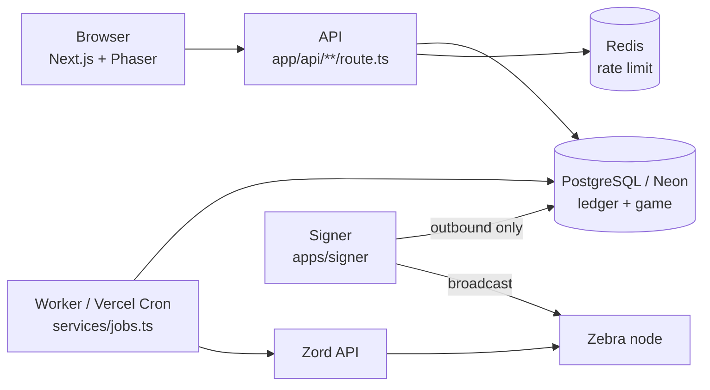

# Architecture: blueprint → code

The browser never talks to Zord or the node directly. All chain data reaches it through our own cached API.

| Blueprint | Where |
|---|---|
| §3.1 ZRC-20 deploy/mint/transfer payloads | `packages/zcash/src/inscriptions.ts`, `apps/signer/src/payload.rs` |
| §3.2 Zord as source of truth | `packages/zord-client/src/zord.ts` (paths overridable via `ZORD_PATH_*`) |
| §3.5 ZIP 317 fees | `packages/zcash/src/fees.ts`, `apps/signer/src/fee.rs` |
| §2 finality (12 → 36 conf), expiry, NU7 freeze | `packages/zcash/src/finality.ts`, `system_flags.freeze_windows`, `inFreezeWindow()` |
| §4.1 pools 80/10/5/5 | `packages/economy/src/constants.ts` → genesis tx `postGenesis()` |
| §4.2 / §8.4 invariants | `packages/db/src/invariants.ts`, job `invariants` (5 min), `balance-cache` (hourly) |
| §4.4 sink (burn vs recycle) | `EconomyParams.sinkMode` (default `burn`) |
| §4.5 wording | `apps/web/lib/content.ts` + `content.test.ts` (fails on forbidden phrases) |
| §5.3 server-authoritative | services never accept amounts from clients; time = server UTC |
| §6.5 chain_registry, PoR page | `chain_registry` table, `/proof-of-reserves`, `/api/public/por`, Admin → Genesis registry |
| §6.7 / §7.2 soulbound pass, claim codes | `packages/db/src/services/passes.ts` (HMAC-peppered codes, owner check job) |
| §7.1 Discord login, account age | `apps/web/auth.ts` |
| §7.3 mining state machine + reward | `packages/economy/src/mining.ts`, `services/game.ts` |
| §7.4 versioned economy config | `economy_config` (append-only), `publishEconomyConfig()`, Admin → Economy config |
| §7.5 daily reward, ore (crypto.randomInt) | `economy/daily.ts`, `rollOreDrops()` scaled by the mined fraction |
| §7.6 provably fair raffle | `economy/raffle.ts` (HMAC-SHA256), `services/raffles.ts`, `/raffles/[id]` browser verifier |
| §7.7 anti-bot | Turnstile (`lib/turnstile.ts`), rate limits (`lib/rate-limit.ts`), freeze |
| §7.8 Phaser scene + admin panel | `components/game/mine-scene.tsx`, `components/admin/admin-app.tsx` |
| §8.1 tables | `packages/db/src/schema.ts` → `packages/db/drizzle/0000_init.sql` |
| §8.3 ledger function | `postLedgerTx()` in `packages/db/src/ledger.ts` |
| §9 API + rules | `apps/web/app/api/**`, `lib/api.ts` (Origin check, idempotency, zod, typed errors, `serverTime`, maintenance) |
| §10 weekly payout | `services/payouts.ts` (cutoff → approval → settle/return), signer contract in [SIGNER.md](SIGNER.md) |
| §11 security, monitoring | CSP/HSTS in `next.config.ts`, alerts → Discord/Telegram, `infra/` |
| §12.1 tests | `packages/*/test`, `apps/web/lib/*.test.ts`, `apps/signer` `cargo test` |

## Ledger accounts

| Code | Meaning |
|---|---|
| `pool_mining`, `pool_daily`, `pool_marketing`, `pool_liquidity` | funded once at genesis |
| `user:<uuid>` | player's in-game balance |
| `sink_burned` | spent in game (upgrades, repairs, tickets) when `sinkMode = burn` |
| `payout_pending` | balances moved out at the weekly cutoff, not yet settled on-chain |
| `treasury_backing` | the only account allowed below zero: −(10B − settled payouts) |

The sum of all accounts is always 0. The sum of every account except `treasury_backing` always equals 10,000,000,000 − settled payouts.

## Idempotency keys

`collect:{session}` · `daily:{user}:{day}` · `upgrade:{slot}:{key}` · `repair:{slot}:{key}` · `exchange:{user}:{key}` · `raffle:{raffle}:{user}:{key}` · `raffle-prize:{raffle}:{k}` · `grant:{key}` · `payout-cutoff:{batch}:{user}` · `payout:{batch}:{user}` · `payout-return:{batch}:{user}` · `genesis`

## Payout item states

`pending` → (admin approves) `approved` → (signer) `signing` → `inscribed` (tx1) → `sent` (tx2) → (worker, after finality + Zord check) `settled`.
Errors go back to `approved` for a retry. After the maximum attempts an item is `failed`, then the worker marks it `returned` (credited back to the player).
